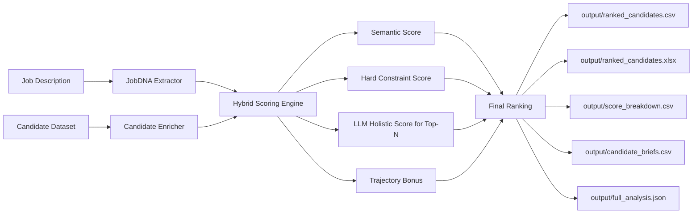

# Talent Intelligence System

A practical, production-style candidate ranking pipeline for the India Runs Data & AI challenge.

This project takes:

- A job description (JD)
- A large candidate dataset

and produces:

- A ranked candidate list
- Explainable score breakdowns
- Recruiter-ready reasoning and interview probes

The system is designed to avoid naive keyword matching by combining semantic similarity, hard-skill constraints, trajectory signals, and optional LLM judgment.

## 1. What This Project Does

The pipeline solves a common recruiting problem:

- Keyword search often over-ranks noisy profiles.
- Pure embedding similarity can miss hard constraints.
- Manual screening does not scale to large pools.

This system addresses all three by blending:

1. Job understanding via structured JobDNA extraction
2. Candidate profile enrichment into recruiter-friendly signals
3. Hybrid scoring (semantic + hard constraints + LLM + trajectory)
4. Export-ready outputs for decision support

## 2. High-Level Architecture



## 3. Repository Structure

```text
talent-intelligence/
    app.py                      # Streamlit dashboard
    run.py                      # CLI entry point
    requirements.txt            # Python dependencies
    .env.example                # Anthropic key template
    data/
        candidates.jsonl          # Candidate pool (main dataset)
        candidate_schema.json     # Schema for candidate records
        sample_submission.csv     # Output format hint
        validate_submission.py    # Optional challenge validation helper
        job_dna.json              # Cached JobDNA (generated after first run)
    output/
        ranked_candidates.csv
        ranked_candidates.xlsx
        score_breakdown.csv
        candidate_briefs.csv
        full_analysis.json
    src/
        jd_parser.py              # JobDNA extraction (LLM + fallback)
        profile_builder.py        # Candidate enrichment (LLM + fallback)
        scorer.py                 # Hybrid scoring engine
        output.py                 # Output generation
        utils.py                  # Env, Claude calls, logging, helpers
    scripts/
        generate_deck.py          # Optional PPT/PDF summary generation
```

## 4. Environment Setup

### Prerequisites

- Python 3.10+ recommended
- Pip
- Optional: Anthropic API key for live LLM scoring

### Windows PowerShell Setup (recommended)

```powershell
cd "d:\Data Science Mark2\talent-intelligence"
python -m venv .venv
.\.venv\Scripts\Activate.ps1
python -m pip install --upgrade pip
python -m pip install -r requirements.txt
```

If activation is blocked in PowerShell:

```powershell
Set-ExecutionPolicy -Scope Process -ExecutionPolicy RemoteSigned
```

To deactivate later:

```powershell
deactivate
```

### API Key Setup (for live mode)

```powershell
copy .env.example .env
```

Then edit `.env` and set:

```text
ANTHROPIC_API_KEY=your_real_key_here
```

## 5. Quick Start

### Safest first run (no API calls)

```powershell
python run.py --dry-run
```

This runs end-to-end using internal fallback logic (no external LLM calls).

### Live run (uses Anthropic API)

```powershell
python run.py
```

Live mode performs:

- JobDNA extraction with Claude
- Candidate enrichment with Claude
- Top-N candidate holistic scoring with Claude

## 6. CLI Usage Details

### Command

```powershell
python run.py [options]
```

### Options

- `--jd PATH` : Path to JD file (auto-detected if omitted)
- `--candidates PATH` : Path to candidate file (auto-detected if omitted)
- `--skip-cache` : Force fresh JobDNA extraction even if cache exists
- `--top INT` : Number of top candidates to run through LLM holistic scoring (default: 40)
- `--dry-run` : Disable external API calls and use deterministic fallback behavior

### Auto-Detection Rules

If you do not pass paths:

- JD file detection picks the first file in `data/` matching:
    - file name containing `jd`, `job`, or `description`, or
    - `.txt` file
- Candidate file detection picks first `csv/xlsx/json/jsonl/gz` in `data/`, excluding files with names containing:
    - `sample_submission`
    - `schema`
    - `metadata`

## 7. Streamlit Dashboard

Run the dashboard:

```powershell
streamlit run app.py
```

What you can do in the UI:

- Trigger a fresh pipeline run from the sidebar
- Toggle dry-run mode
- Search and filter rankings
- Compare candidates side by side
- Inspect signal distributions and artifacts

The dashboard reads the latest files in `output/` and can be used even in dry-run mode.

## 8. Scoring Logic (Implementation-Accurate)

The final score is bounded to [0, 1] and computed as:

$$
\\text{final} = 0.30\cdot S_{semantic} + 0.25\cdot S_{hard} + 0.35\cdot S_{llm} + 0.10\cdot B_{trajectory}
$$

Where:

- $S_{semantic}$: cosine similarity between job text and candidate text
    - Uses `BAAI/bge-small-en-v1.5` embeddings when available in live mode
    - Falls back to hashing-vector features in constrained environments
- $S_{hard}$: BM25-based hard constraint match score (normalized)
    - Uses dealbreaker skills + job title tokens
    - Applies penalty when too many dealbreaker tokens are missing
- $S_{llm}$:
    - For top-N candidates: LLM overall score scaled from 0-10 to 0-1
    - For candidates outside top-N: falls back to pre-LLM combined signal
- $B_{trajectory}$: rule-based bonus in [-0.10, 0.10], based on:
    - Career trajectory (ascending/inconsistent)
    - Initiative signals count
    - Red-flag count
    - Estimated years of experience versus role seniority

### Important Note About Weighting

Because trajectory is multiplied by `0.10`, its effective contribution to final score is small but meaningful. It acts as a tie-break/quality signal rather than a dominant factor.

## 9. JobDNA and Candidate Enrichment

### JobDNA extraction

`src/jd_parser.py` extracts a structured object including:

- `job_title`
- `seniority_level`
- `core_skills` with weights and dealbreaker flags
- `adjacent_skills`
- `domain_expertise`
- `org_context`
- `hidden_requirements`
- `dealbreakers`
- `what_great_looks_like`
- `what_mediocre_looks_like`

In dry-run mode, a fallback heuristic generates this structure locally and caches it to `data/job_dna.json`.

### Candidate enrichment

`src/profile_builder.py` turns each raw candidate record into a recruiter-oriented profile summary and extracts:

- inferred strengths
- career trajectory
- leadership evidence
- initiative signals
- red flags
- standout signal
- seniority estimate
- top skills and domain history

Concurrency is asynchronous with bounded parallelism to scale to larger datasets.

## 10. Input Data Contract

The candidate dataset follows the JSON schema in `data/candidate_schema.json`.

Each candidate includes (top-level):

- `candidate_id`
- `profile`
- `career_history`
- `education`
- `skills`
- `certifications`
- `languages`
- `redrob_signals`

Supported candidate file formats:

- `.csv`
- `.xlsx`
- `.json`
- `.jsonl`
- `.jsonl.gz`

Supported JD formats:

- `.docx`
- plain text files

## 11. Output Files Explained

After a successful run, `output/` includes:

1. `ranked_candidates.csv`
     - Submission-style ranking output
     - Default columns: `candidate_id`, `rank`, `score`, `reasoning`
     - If `data/sample_submission.csv` exists, its header is used automatically

2. `ranked_candidates.xlsx`
    - Excel version of the ranked shortlist for easier review and sharing
    - Contains the same ranked columns as the CSV export

3. `score_breakdown.csv`
     - Transparent signal-level values per candidate
     - Includes semantic, hard, LLM, trajectory, and final score columns

4. `candidate_briefs.csv`
     - Recruiter-facing shortlist brief
     - Includes verdict, strengths, risks, red flags, interview probes

5. `full_analysis.json`
     - Full detailed record for each candidate
     - Best for deep analysis, auditing, and debugging

## 12. Performance and Scaling Notes

- Candidate enrichment uses async batching and concurrency limits.
- LLM holistic scoring is only applied to top-N candidates (`--top`) to control cost and latency.
- Dry-run mode is useful for development, CI checks, and offline testing.
- JobDNA cache (`data/job_dna.json`) avoids repeated extraction calls.

## 13. Troubleshooting

### 1) Missing API key error

Symptom:

- Pipeline fails with missing `ANTHROPIC_API_KEY`

Fix:

- Add the key to `.env`
- Or run with `--dry-run`

### 2) PowerShell activation blocked

Fix:

```powershell
Set-ExecutionPolicy -Scope Process -ExecutionPolicy RemoteSigned
```

Then activate `.venv` again.

### 3) No outputs generated

Check:

- JD and candidate files are valid and detectable
- Run logs for parse/format issues
- Candidate file is not accidentally filtered by detection rules

### 4) Slow run on very large data

Options:

- Start with `--dry-run`
- Reduce `--top` for live runs
- Test on a smaller candidate subset first

## 14. Optional: Generate a Deck

You can generate summary artifacts from current outputs:

```powershell
python scripts/generate_deck.py
```

Depending on available dependencies, this can create:

- `output/tis_deck.pptx`
- `output/tis_deck.pdf`
- fallback `output/tis_deck.txt` (if needed)

## 15. Suggested Workflow for Recruiters

1. Start with `python run.py --dry-run` to validate pipeline and output shape.
2. Switch to live mode for richer LLM judgment.
3. Open dashboard with `streamlit run app.py`.
4. Use `ranked_candidates.csv` for submission and shortlist.
5. Use `candidate_briefs.csv` and `full_analysis.json` for interview planning.

## 16. Current Limitations

- LLM-based components add external dependency and cost in live mode.
- The ranker is rule and weighted-score based, not learned from historical hiring outcomes.
- Output quality depends on input profile quality and completeness.

## 17. Future Improvements

- Add offline evaluation benchmark sets and calibration metrics
- Add caching for repeated candidate profiling
- Add score calibration against recruiter decisions
- Add configurable weight profiles by role family

---

If you are running this for the first time, use:

```powershell
python run.py --dry-run
```

and inspect files in `output/` before moving to live API mode.
